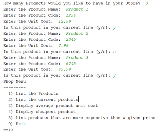

[BACK](/topics/topic10/lab10/02.html) [NEXT](/topics/topic10/lab10/04.html)

## ShopV2.2 - Console Menu System

In IntelliJ, create a new project called **ShopV2.2**.

Copy your completed ShopV2.1 java files (Driver, Store and Product) into this new project.  Alternatively, you can use our solution: [ShopV2.1](archives/ShopV2.1.zip).

There will be no changes in the `Product` and `Store` classes.  All the changes below are in the `Driver` class.  We are going to add a menu to our app, so that the user can choose what options they would like to call.  

### Driver class

Add the following new methods to your Driver class:

~~~java
    private int mainMenu(){
        System.out.print("""
               Shop Menu
               ---------
                  1) List the Products
                  2) List the current products
                  3) Display average product unit cost
                  4) Display cheapest product
                  5) List products that are more expensive than a given price
                  0) Exit
               ==>> """);
        int option = input.nextInt();
        return option;
    }
~~~

~~~java
    private void runMenu(){
        int option = mainMenu();

        while (option != 0){

            switch (option){
                case 1 -> printProducts();
                case 2 -> printCurrentProducts();
                case 3 -> printAverageProductPrice();
                case 4 -> printCheapestProduct();
                case 5 -> printProductsAboveAPrice();
                default -> System.out.println("Invalid option entered: " + option);
            }

            //pause the program so that the user can read what we just printed to the terminal window
            System.out.println("\nPress enter key to continue...");
            input.nextLine();
            input.nextLine(); //second read is required - bug in Scanner class; a String read is ignored straight after reading an int.

            //display the main menu again
            option = mainMenu();
        }

        //the user chose option 0, so exit the program
        System.out.println("Exiting...bye");
        System.exit(0);
    }
~~~

The first method `mainMenu` displays the menu to the console and waits for the user to enter their choice (i.e. a number option).  When they enter a number, it is returned from the method.

The second method `runMenu` controls the repeated display of the above menu and processes the actual option selected by the user.  When option 0 is entered, then this method closes down the program.

Now change your `main` method to be this:

~~~java
   public static void main(String[] args) {
        new Driver();
    }
~~~

And add the following constructor:

~~~java
    public Driver() {
        processOrder();
        runMenu();
    }
~~~

### Test the menu

Now that you have the menu code in the Driver class, you are in a position to test it.  

Run the Driver class and enter the details for, say, 3 products.  The menu should now be displayed and should look something like this:

Test each option and make sure that the output is what you expected.  Test an invalid option too (e.g. 9) and then test the exit option (0) last.

Save your work
