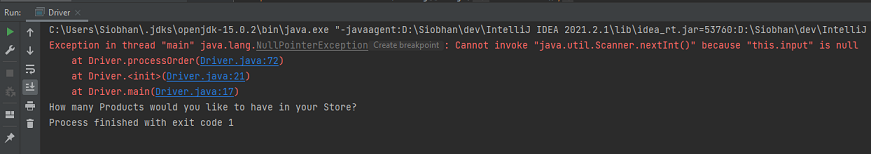

[BACK](/topics/topic10/lab10/03.html) [NEXT](/topics/topic10/lab10/05.html)

## Exercises

In this step, we are just going to generate another type of Exception, so that you start becoming familiar with them.  

In last weeks labs, we crashed our program with an `InputMismatchException` when we entered a **String** when an **int** was expected.

In this step, we will generate a `NullPointerException` in a number of places, so that you become familiar with recognising and fixing them.  

You can continue working in your [ShopV2.2](archives/ShopV2.2.zip) code...we have linked it here in case you need it.  

### Generating a Null Pointer

When you call a method over an object that hasn't been instantiated yet, your program will crash with a `NullPointerException`.  Let's generate one now.  

Currently, in Driver, we have the following `Scanner` object being instantiated:

~~~java
   private Scanner input = new Scanner(System.in);
~~~

Change this line of code to be (i.e. we are removing the instantiation):

~~~java
private Scanner input;
~~~

Now run your app.  Your app should have crashed with an exit code 1 and a `NullPointerException`.

Recall that we read these call stack dumps by starting at the bottom of the red output and working our way up.  We can see that the first method call was in the main method in Driver.java on line 17, which in our code was:

~~~java
    new Driver();
~~~

Then the second method call was in the constructor (the `init`) in Driver.java on line 21, which in our code was:

~~~java
    processOrder();
~~~

After that, the Scanner method (nextInt) was called over the Scanner object `input` on line 72 in Driver.java:

~~~java
   int numberProducts = input.nextInt();
~~~

As we didn't instantiate the `input` object - remember we removed the code `= new Scanner(System.in)`, our program crashed.  

Replace the removed code and run your program to make sure it is no longer crashing.  

### Generate a second Null Pointer

These `NullPointerException` crashes are typically caused by mistakes in the code...note how we removed proper code to demonstrate it.

Now try generate another of these exceptions on the `store` object - just remove the instantiation and run your code.  See can you follow the red `call stack dump` to locate the source of the error.  

When finished, make sure you put your code back to the original working code.
