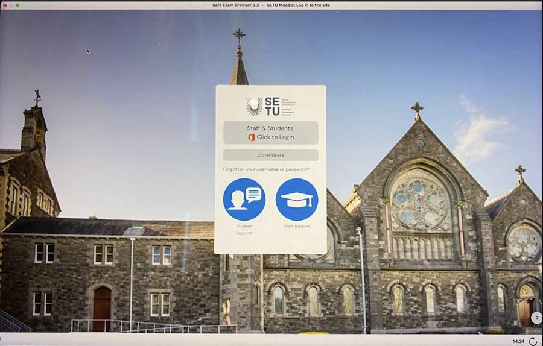
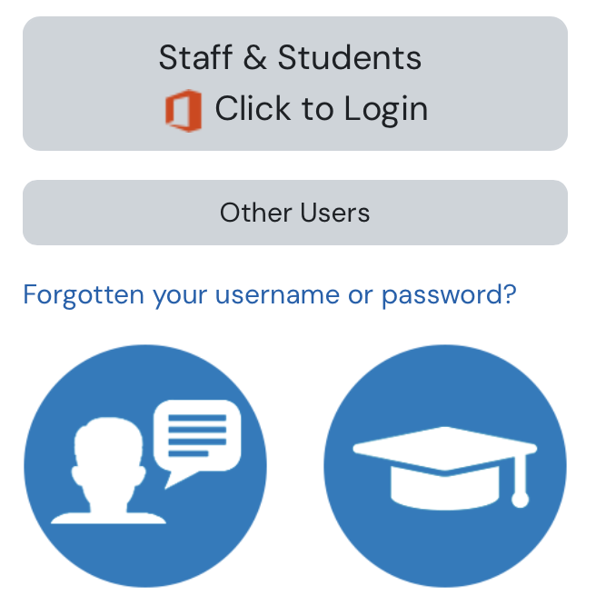
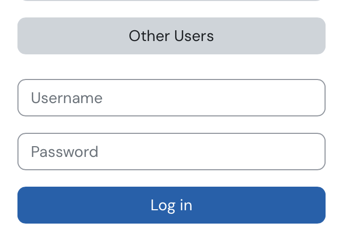
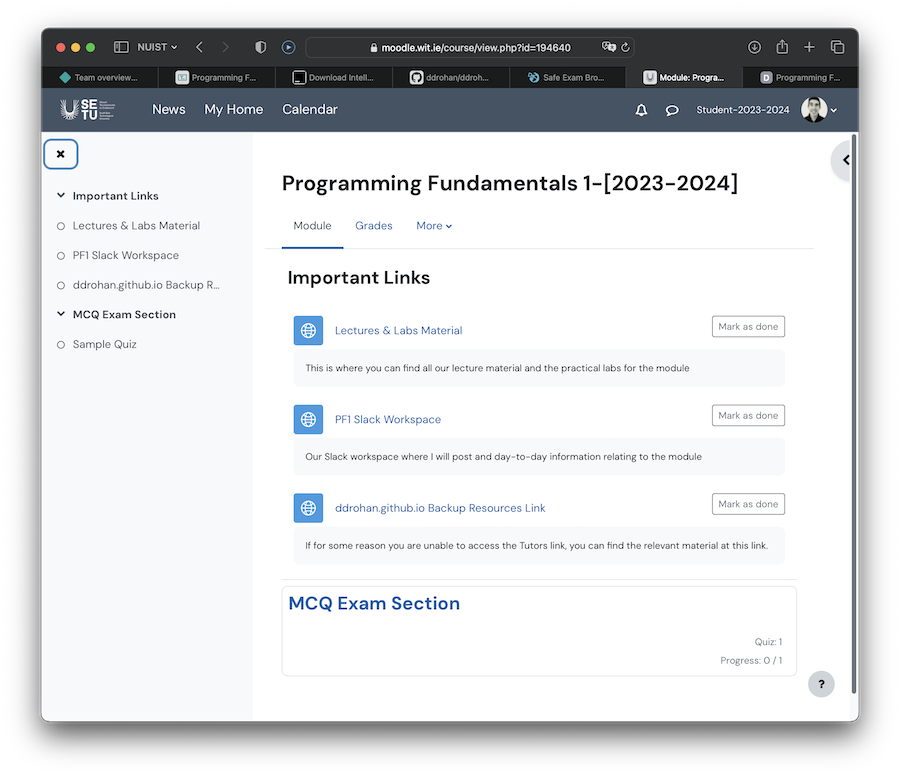

# Moodle Login Steps

1. Visit [http://moodle.wit.ie](http://moodle.wit.ie) and you will be presented with a screen, something like this:

2. Select `Other Users`

3. When you select `Other Users`, you will be presented with a screen, something like this:

4. Here, enter your **`SETU Moodle account details`**, like so:

- Each student `username` is their **student number@wit.ie**  e.g. **123123223123@wit.ie**

- Each student `password` is **Moodle2023** ( you will be forced to change your password the first time you login)

5. Once you have successfully logged in and changed your password, you should now see the **Programming Fundamentals 1 Moodle Home Page**, something like this:

