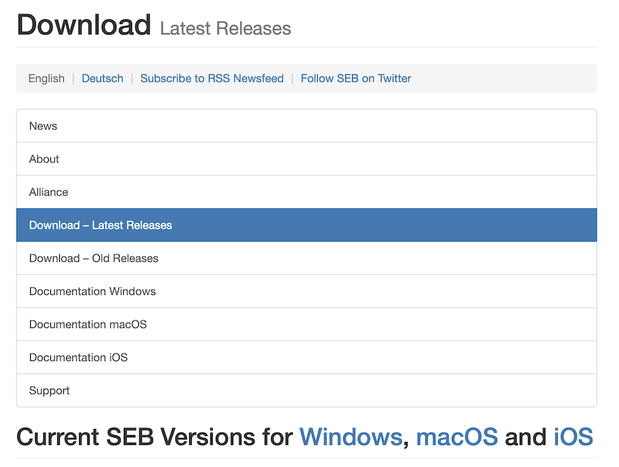
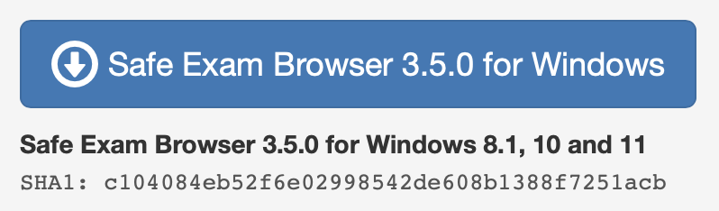
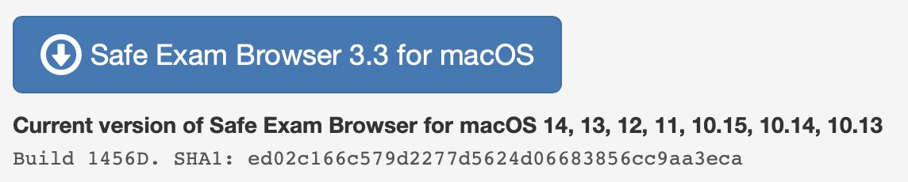
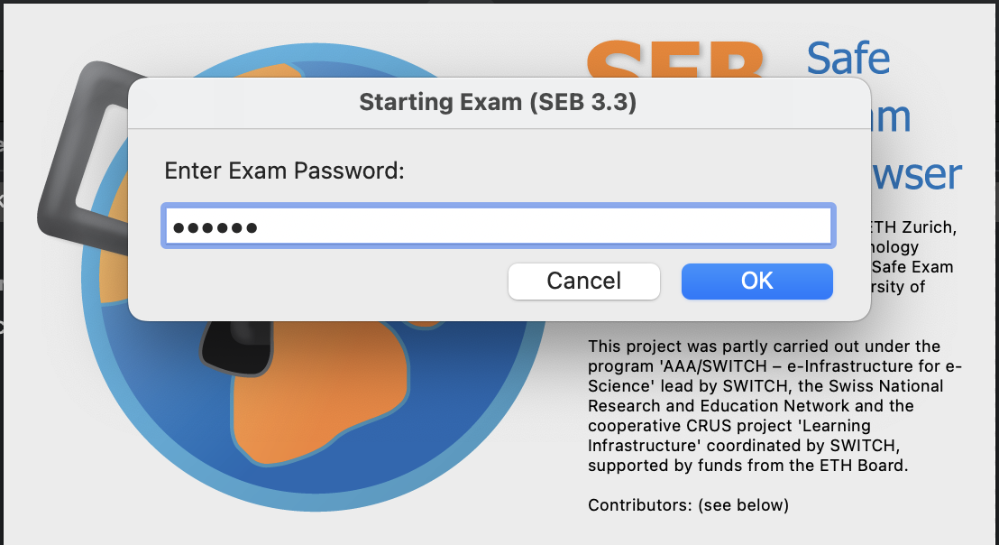
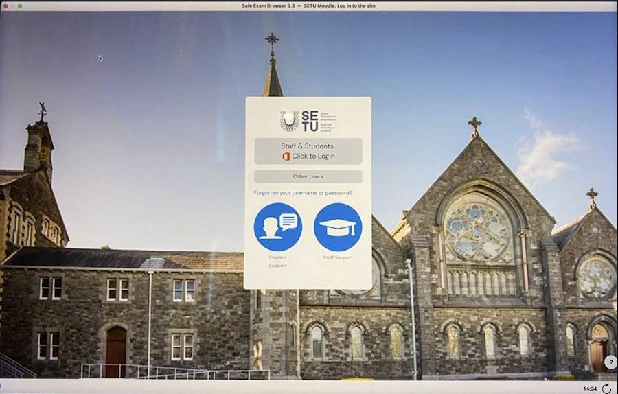
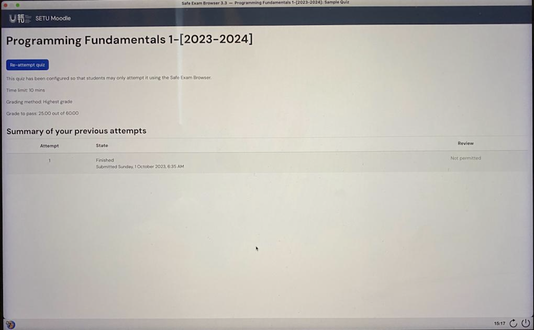

[BACK](/topics/topicseb/seblab/01.html) [HOME](/index.html)

## Installing SEB (Safe Exam Browser)

- the first thing to do is download the relevant install program for either WINDOWS or MAC.

## Downloading SEB

- The SEB can be downloaded from <https://safeexambrowser.org/download_en.html>.

- Choose the version you need:

### Windows (Version Numbers may differ)

- An **.exe** file will start to download (from sourceforge.net).  

  Take note of where this file downloaded to, once the download is complete.

### Mac (Version Numbers may differ)

- A **.dmg** file will start to download (from sourceforge.net).  

  Take note of where this file downloaded to, once the download is complete.

**NOTE : If you have any issues downloading either of these install programmes, please contact your lecturer who can assist you with this.**

Once the files are downloaded, you will need to navigate to where you saved the install program and run/install the program file.

Once SEB has installed download the following configuration file

- [testmcq.seb](archives/testmcq.seb)

This is a sample Moodle MCQ which you can test to confirm your SEB installation and Moodle account are working correctly.

Navigate to where you have downloaded the `.seb` file above and double-click/launch it.

This should launch SEB with the settings configured in the file.

You should first see the following window :

so enter `123456` as the password.

Next, a browser window, something like this:

So, select `Staff & Students` and log in with your Moodle credentials.

Once you are logged in, you should be taken directly to the sample MCQ, like so:

Attempt the test as many times as you like :)

**This will be similar to your actual MCQ that you will be officially graded on so it is `VERY IMPORTANT` that you can confirm that you are able to complete all the above steps and attempt/complete the sample MCQ.**

***If you cannot complete any of the above steps you must contact your lecturer as soon as possible, as failure to do so could result in you not being able to attempt the official MCQ and fail to achieve any marks in the official assessment.***
